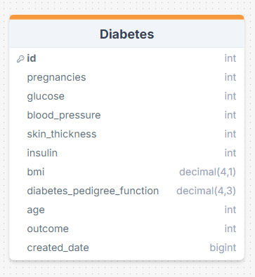

<link rel="stylesheet" href="https://cdn.jsdelivr.net/gh/devicons/devicon@latest/devicon.min.css">
<h1 align="center">Django Diabetes Predictor 🩺</h1>
<h3 align="center">A sample project that utilizes Django REST Framework and an SVM model to predict diabetes, showcasing how to build a predictive API.</h3>

<p align="center" style="display:flex; gap:16px; justify-content:center; align-items:center">
<a href="https://www.python.org/" target="_blank"></a>
<a href="https://www.djangoproject.com/" target="_blank"></a>
<a href="https://www.django-rest-framework.org/" target="_blank"></a>
<a href="https://www.docker.com/" target="_blank">
</a>
</p>

### Overview

-   [Overview](#overview)
-   [Features](#features)
-   [Setup](#setup)
-   [Database Schema](#database-schema)
-   [Bugs or Opinions](#bugs-or-opinions)

### Features

-   **🐳 Dockerized**: Fully containerized using Docker for easy deployment and consistency across environments.
-   **🌐 RESTful API**: Well-designed API built with Django REST Framework, following best practices.
-   **🛠️ Development and Production Environments**: Separate configurations optimized for development and production.
-   **🐘 PostgreSQL Database**: Utilizes PostgreSQL for robust data storage and retrieval.
-   **🚀 Django LTS (4.2.16)**: Built on Django's Long Term Support version for stability and long-term support.

### Setup

To get this repository, run the following command in your Git-enabled terminal:

```bash
git clone https://github.com/tareqWpy/django-diabetes-predictor.git
```

#### 🐳 One command and bingo!:

Navigate to your project directory where the docker-compose.yml file exists:

```bash
docker compose up --build
```

### Database Schema

A simple view of the project model schema.

<p align="center">

</p>

### Bugs or Opinions

Feel free to let me know if there are any issues or requests you have for this repo! 😊
